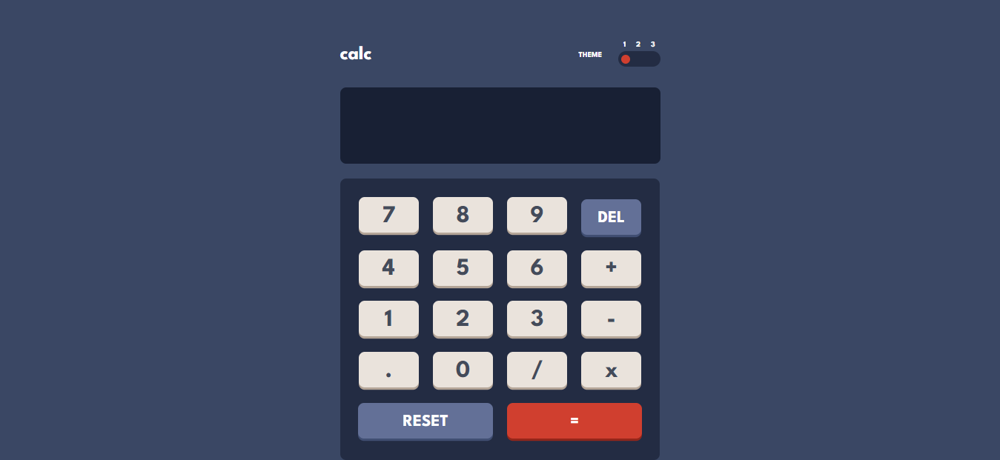

# Frontend Mentor - Calculator app solution

This is a solution to the [Calculator app challenge on Frontend Mentor](https://www.frontendmentor.io/challenges/calculator-app-9lteq5N29). Frontend Mentor challenges help you improve your coding skills by building realistic projects.

## Table of contents

- [Overview](#overview)
  - [The challenge](#the-challenge)
  - [Screenshot](#screenshot)
  - [Links](#links)
- [My process](#my-process)
  - [Built with](#built-with)
  - [What I learned](#what-i-learned)
  - [Continued development](#continued-development)
  - [Useful resources](#useful-resources)
- [Author](#author)
- [Acknowledgments](#acknowledgments)

## Overview

### The challenge

Users should be able to:

- See the size of the elements adjust based on their device's screen size
- Perform mathmatical operations like addition, subtraction, multiplication, and division
- Adjust the color theme based on their preference
- **Bonus**: Have their initial theme preference checked using `prefers-color-scheme` and have any additional changes saved in the browser

### Screenshot



### Links

- Solution URL: [Github Repository](https://github.com/AlanJVD/Calculator-app)
- Live Site URL: [Github Pages](https://alanjvd.github.io/Calculator-app/)

## My process

### Built with

- HTML5
- CSS
- JavaScript

### What I learned

I learned how to create a simple toggle switch and style it, as well as about the JavaScript 'eval' function, 'attributeStyleMap', and 'substring'.

```html
<input
  id="switch"
  type="range"
  name="points"
  min="1"
  max="3"
  value="1"
  onchange="toggleSwitch()"
/>

<input
  class="key"
  type="button"
  value="7"
  onclick="document.calculator.screen.value += '7'"
/>
```

```css
input[type="range"]::-webkit-slider-thumb {
  -webkit-appearance: none;
  background: hsl(6, 63%, 50%);
  width: 15px;
  height: 15px;
  border-radius: 50px;
  cursor: pointer;
}

.key:active {
  filter: brightness(1.2);
}
```

```js
const keys = document.getElementsByClassName("key");
for (let index = 0; index < keys.length; index++) {
  const allKey = document.getElementsByClassName("key")[index];
  allKey.attributeStyleMap.clear();
}

let screenValue = document.getElementById("screen-input").value.toString();
let newValue = screenValue.substring(0, screenValue.length - 1);

const equal = () => {
  try {
    if (document.calculator.screen.value != "") {
      document.calculator.screen.value =
        Math.round(eval(document.calculator.screen.value) * 10) / 10;
    }
  } catch (error) {
    document.calculator.screen.value = "Error";
  }
};
```

### Continued development

I will be practicing JavaScript in order to improve my programming logic. Also, I will be reading the documentation of HTML, CSS and JavaScript.

### Useful resources

- [w3schools](https://www.w3schools.com/) - This helped me to understand more about CSS. I'd recommend it to anyone still learning.
- [codepen](https://codepen.io/) - This helped me to create a toggle switch to change the theme of the calculator.
- [Techie Delight](https://www.techiedelight.com/es/) - I would recommend it to anyone who wants to learn more about JavaScript.

## Author

- Frontend Mentor - [Alan Delgado](https://www.frontendmentor.io/profile/AlanJVD)
- LinkedIn - [Alan Delgado](https://www.linkedin.com/in/alan-delgado-528629256/)

## Acknowledgments

I want to thanks [Anthony Zabs ](https://www.youtube.com/@AnthonyZabs) for his helpful tutorial on making a simple calculator with just one line of JavaScript code. It really helped me in developing this calculator.
